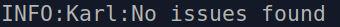

# Contracts

# Addresses on Rinkeby:
BaseContract: 0x33CCa1820C93C20974E06ff366c3b28b06809277
StoreFunctions: 0x71F11D51D49537cD7B460da705f2d9Dc76E90eac (This may not be needed)

## BaseContract

Contract is a basic ERC1155 with some basic additional important functionalities:

1. There are, by default, two operators in the contract, named us, the GoBlockchain and the business owners of the store.
1.1 Since we will be doing the deploys of the contracts, the client in the constructor of the contract is the business owner wallet address. Once clients are deploying their own contracts, that client can be set to be the GoBlockchain or the owner himself. It is important to notice that the msg.sender is the ADMIN_ROLE & OPERATOR in the contract, and the address passed in is only the OPERATOR. That can be changed by the owner of the contract thorough the function ```granRole``` inherited from the ```Access Control``` contract.

2. Name in the constructor is the name of the collection of the NFTs that will be launched and shown on OpenSea/Metamask/Rarible, etc.

3. The current BaseContract uses the interface IERC2189, which is an interface related to royalties. The interface is voluntarily implemented on the marketplaces, so the ```royaltiesRecipient``` wallet or contract will only be able to receive percentage over purchases done in marketplaces that implement this IERC2189. For the current moment, OpenSea on testnet does not implement it. The ```royaltiesRecipient``` will receive the ```royaltiesPercentage``` over secondary purchases within the applicable marketplaces. The ```royaltiesPercentage``` can vary from 0 to 100, 0 being 0% over the secundary purchases and so on. A good value for this is 5.

4. Only the operators can mint in the contract as far as we have it.

5. Only the tokenOwner can burn his own NFT - and only once at a time.

6. The ID of the minted NFTs increases automatically each time a NFT is minted to avoid multiple mints of the same NFT, making is inflactionary.

7. There is the possiblity to change the baseURI of the contract in case the ADMIN_ROLE wants to.

## StoreFunctions

Contract is used in the front-end. It contains basic functionalities for selling and buying NFTs.

IMPORTANT NOTE:
Once the NFTs are minted in the BaseContract, the ***owner of the NFTs*** must call the function ```setApprovalForAll``` so that he approved all HIS NFTs to be sold in our little marketplace passing in as a parameter the address of the deployed StoreFunctions contract before selling them through the StoreFunctions contract.

1. The most important caracteristic of the contract is that it implements the ```PaymentSplitter``` contract from the OpenZeppelin. This way, all the money sent to buy a NFT is stored in the contract's balance. Each of the payees that were passed in the constructor of the contract will be forever able to call the ```release(address payee)``` function to withdrawy their funds whenever they want. Each payee chooses when to withdraw his own part. It is important to notice that there is no way to change the people who are the payees since the functions that would make it possible are marked as ***private*** on the ```PaymentSplitter``` contract, so that the level of security can be maintained. Overrind those functions to add such functionality may diminish the contract's security. 

2. The contract is also ```ReentrantGuard``` to avoid someone calling the same function multiple times in the same call.

3. Only the owner of a NFT can make the sell offer of them in our contract. He may do so in the ```makeSellOffer``` function or in the ``batchSellOffer`` function

Basically, the contract receives money and this money can be withdrawn individually by the ***payees*** whenever they want being independent of each other and also receiving their respective proportions.

Flow:

According to our implementation of these contracts, there are 3 kinds of ways for us to deploy them and it will be up to us and the store business owner decide which approach we should take for each store.

### For the Business Owner Who Does Not Know About Blockchain

1. We deploy both contracts for them (ERC1155 & StoreFunctions)
2. We mint those NFTs to ***OUR*** account. (ERC1155)
3. We approve the other contract to sell the nfts. (ERC1155 - setApprovalForAll)
4. We make the selloffers specifying the price & amount of tokens to be sold (StoreFunctions)
5. We ***MAY*** transfer a NFT for the business owner for him to be happy.
6. People Buy!
7. We withdraw ***OUR PART*** accumalated money in the contract as often as we want.
8. The business owner withdraw ***HIS PART*** in the contract whenever he wants.

It is important to note that we need to mint the NFTs to ***OUR*** account because if we mint to THEM, we would need to wait on them to setApproveForAll their tokens to be sold in our contract StoreFunctions, because we cannot do it for them - image if this was possible in the ERC1155, I could basically put the NFTs of other people to be sold anywhere for any price, inclusing for free. Then, the setApprovalForAll has only effect if the owner of the NFTs calls it and HE says who has the power to sell HIS NFT.

### For the Business Owner Who Know About Blockchain

They = Business Owner and His Fellows

1. They deploy both contracts for them adding us as a receiver of part of the accumulated money in the contract. (ERC1155 & StoreFunctions)
2. They mint those NFTs for ***THEIR*** account. (ERC1155)
3. They approve the other contract to sell the nfts. (ERC1155)
4. They make a selloffer specifying the price & quantity (StoreFunctions)
5. People Buy!
6. We withdraw ***OUR PART*** accumalated money in the contract as often as we want.
7. The business owner withdraw ***HIS PART*** in the contract whenever he wants.

## Deploy

The appropiate to deploy the contracts is:
    1. Create a local **.env** file with the following structure:

    > MUMBAI= Infura or Alchemy API link and project id for Mumbai Polygon Testnet
    > RINKEBY= Infura or Alchemy API link and project id for Rinkeby Testnet
    > POLYGON= Infura or Alchemy API link and project id for Polygon Mainnet
    > ETHEREUM_MAINNET= Infura or Alchemy API link and project id for Ethereum Mainnet
    > PRIV_KEY= Private Key of Account making the deploy.
    > ETHERSCAN_ETHEREUM= Etherscan API Key for verify and publish on Etherscan Ethereum 
    > ETHERSCAN_RINKEBY= Etherscan API Key for verify and publish on Etherscan Rinkeby
    > POLYGONSCAN_POLYGON= PolygonScan API Key for verify and publish on Etherscan Polygon
    > POLYGONSCAN_MUMBAI= PolygonScan API Key for verify and publish on Etherscan Mumbai

<div></div>

    An example of an **env** file can be seen below:

    > MUMBAI="https://polygon-mainnet.infura.io/v3/GOBLOCKCHAIN_ID"
    > RINKEBY="https://rinkeby.infura.io/v3/GOBLOCKCHAIN_ID"
    > POLYGON="https://polygon-mumbai.infura.io/v3/GOBLOCKCHAIN_ID"
    > ETHEREUM_MAINNET="https://mainnet.infura.io/v3/GOBLOCKCHAIN_ID"
    > PRIV_KEY=XXXXXXXX
    > ETHERSCAN_ETHEREUM=YYYYYYY
    > ETHERSCAN_RINKEBY=YYYYYYY
    > POLYGONSCAN_POLYGON=PPPPPP
    > POLYGONSCAN_MUMBAI=PPPPPP

<div></div>

    2. Once the **env** file is created and ready, go to the ```scripts/deploy.js``` file
    and check all that all the fields are well set as explained below and inside the ```scripts/deploy.js``` file:

    > // Link to NFTs metadata
    > let _contractURI = "ipfs://CID/{id}"
    > // Name of Collection to be Shown on Opensea/Metamask/etc
    > let _name = "My Store"
    > // Carteira do Clinte
    > let _client= "0x0000000000000000000000000000000000000000"
    > // Porcentagem de Royalties Na Venda Secundaria das NFTs dentro de um Marketplace
    > let _royaltiesPercentage = 1
    > // Wallet Address Para O Qual o Dinheiro Dos Royalties Will Go
    > let _royaltiesRecipient= "0x0000000000000000000000000000000000000000"
    > // Wallet Address From GoBlockchain Team
    > let goBlockchainAddress = "0x0000000000000000000000000000000000000000"
    > // GoBlockchain Fee Percentage In Each Sale Made In Our Store
    > let GO_FEE = 10
    > // Client Fee Percentage In Each Sale Made In Our Store
    > let CLIENT_FEE = 90
    > // Note: CLIENT_FEE + GO_FEE Must be Equal to 100%. 
    > //If More People Are Added, All The Fees Must Sum Up to 100%

<div></div>

    3. Once the variables inside the deploy.js are well set, then run the following command inside the **official** folder:
    To deploy on Rinkeby Tesnet: `npx hardhat run scripts/deploy.js --network rinkeby`
    To deploy on Ethereum Mainnet: `npx hardhat run scripts/deploy.js --network mainnet`
    To deploy on Polygon Mainnet: `npx hardhat run scripts/deploy.js --network polygon`
    To deploy on Mumbai Tesnet: `npx hardhat run scripts/deploy.js --network mumbai`

<div></div>

    A similar text like the one below should appear on the terminal:

    > Nothing to compile
    > BaseContract deployed to: 0xe5893775B0966200C1190c7F95355413Bf52f35F
    > BaseContract hash: 0x5272f763081ec717c66d4371ea2ed2c4e4165cb036a106cd7a1aae8cc71cc938
    > BaseContract owner: 0x7ded4ab0E3A23c550318a0b8C6030f4581AaC54c
    > BaseContract chainId: 4
    > 
    > 
    > StoreFunctions deployed to: 0x8f0eD3c18E52a4c05436305a259cE7e054A53E8C
    > StoreFunctions hash: 0x84b3924622a2795273f80280e09b7eb388cbebb6092a3c143320b34a9c59eaf2
    > StoreFunctions owner: 0x7ded4ab0E3A23c550318a0b8C6030f4581AaC54c
    > StoreFunctions chainId: 4


## Tests

Tests need to be done more massively, but yet the basic functionalities are working well without any sign of possible attack. It is important to notice also that we have implemented only other EIPs in our contracts, so they are fully tested for us only to use. In fact, the contract BaseStorage  has been tested by its developers and the StoreFunctions need to be more massively tested in only three functions that were created by us, because the rest are only functions from EIPs or getter functions.

### Step by Step: How to Clone A Store:

1. Import Wallet from GoBlockchain Into Metamask
2. Deploy BaseContract:
    - Constructor:
        - _contractURI: URI link for the prepolated folder that contains the NFTs.
        - _name: Collection name for NFTs to be shown the OpenSea/Metamask website.
        - _client: Wallet address from client.
        - _royaltiesPercentage: Royalties percentage for the secondary market. A good range is in between 1-5%.
        - _royaltiesRecipient: Wallet address to receive the royalties. It can be an EOA or a Contract Address that can have a logic to split the royalties among multiple EOAs.
    
    _contractURI = "ipfs://CID/{id}"
    _name = "My Store Collection"
    _client = 0x0000000000000000000000000000000000000000
    _royaltiesPercentage = 3
    _royaltiesRecipient = 0x0000000000000000000000000000000000000000

3. Mint NFTs in the BaseContract:
    - Amount: 1 (NFT), > 1 (Semi-Fungible)
    - Data: []
    - To: 0x0000000000000000000000000000000000000000

4. Deploy StoreFunctions:
    - Constructor:
        - _payees: Array that includes all the EOAs that will receive the money that comes from the sellings of the NFTs. Don't forget to put the address inside quotes. The payees array can be of length > 1.
        - _shares: Array that includes the percentages that will be given to each of the payees. The length of the _shares array must be equal to the length of the _payees array.
        - _addr: Address of the 1155 BaseContract that was just deployed.
    - _payees: ["0x0000000000000000000000000000000000000000", "0x0000000000000000000000000000000000000001"]
    - _shares: [10,90]
    - _addr: 0x495f947276749Ce646f68AC8c248420045cb7b5e (EXAMPLE)

5. setApprovalForAll in the BaseContract:
    - operator: Address of the deployed StoreFunctions contract.
    - boolean: Set it to true so that the StoreFunctions contract will be able to negociate the NFTs in the BaseContract.
        - operator: 0x177e3e1cbA47340F3c24d1B3D4dC511099BFfeA8
        - boolean: true

6. makeSellOffer in the StoreFunctions contract:
    - tokenId: the id of the token for which a sell offer will be made.
    - price: the price in WEI for each unit of the token being sold.
    - amount: the amount of tokens to be sold. The amount should be less than or equal to what the EOA selling the tokens possesses. The price to buy all the tokens being sold is then ```amount * price ```
        - tokenId: 0
        - price: 10000000000000000 (0.01 ETH)
        - amount: 300
        
7. The following step is done if the owner of the NFTs want to place many orders of NFTs to be sold at once. 
    batchSellOffer in the StoreFunctions contract:  
    - tokenId: An array composed of all the tokenIds of the NFTs for which the selling is to be made.
    - amounts: An array with the amount of the NFTs to be sold mapped to which of the tokenIds
    - price: The price for which all these NFTs will be sold. 
        - tokenId: [0,1,2,3,4,5,6,7,8,9,10,11,12]
        - amounts: [1,1,1,1,1,1,1,1,10,12,13,2000,14]
        - price: 10000000000000000 (0.01 ETH)

### How to Buy An NFT:

1. Using the functions ```buyToken```: the buyer sends the necessary value to buy the NFT he wants in the ***value*** parameter of the transaction being done. If he wants to buy more than one NFT, he needs to send the value of a unique semi-fungible (because the it will be a token with multiple copies) times the amount he wants to buy. Basically:
    - itemId: The number of the token being sold. It is different to the tokenId in the sense that the itemId represents the chronological order in which a token was put to be sold. Item contains more information about a token like: how many are left, are all sold?, etc.
    - amount: The amount to be bought of that item being sold.


### Front-End Interaction

1. The function ```fetchMarketItems()``` displays all the necessary information about all items being sold. Used along with the ```uri()``` function can be used to retrieve the media that represents the tokens so that they can displayed in a human-friendly way. The two arguments are:
    - _pageNumber: It is the page to find the NFTs. The page number and the results per page are dependable on each other. If I have 50 NFTs being sold, I can have 5 pages with 10 NFTs each. Therefore, the _pageNumber for the second page is then: 2.
    - _resultsPerPage: It is the amount of results to be gotten from all the available NFTs to be sold. If I have 50 NFTs being sold, I can have 5 pages with 10 NFTs each. Therefore, the _pageNumber for the second page is then: 2. The resultsPerPage would then be: 10.
        - _pageNumber: 2
        - _resultsPerPage: 10

## OBS
In 7 under the topic ***Step by Step: How to Clone A Store***, the argument price of the ```batchSellOffer``` function can be improved to be an array that represents each price for each of the NFTs being sold. A unique price for each of all the NFTs being sold is now implemented since we currently use Remix to make such transactions and Remix gets oveloaded when there is an array with such big numbers, like 1 ETH represented in WEI. As we implement a deployed method using web3, then it will be much easier to pass an argument with such big numbers without any problems.

## Security 

We have used the open-souce tool for smart contracts security verification and have found out that there are no issues concerning vulnerabilites. It shows then how our contract is - for the best of our ability - secure.



